<div align="center">

# 🔐 SC-500 Lab 08 - AI Identity & Access Security

### Microsoft Entra ID + Azure RBAC + Managed Identity + Microsoft Foundry + Keyless AI + KQL


**Engineer-Level Cloud & AI Security Validation Lab**

**Status:** `SECURITY SIGN-OFF COMPLETE`  
**Evidence:** `E19 → E83`

</div>

---

# 🖼️ SC-500 Lab 08  Banner

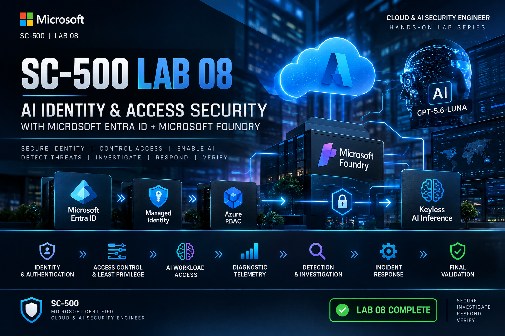

**Figure 01 — SC-500 Lab 08: AI Identity & Access Security**  
*Identity-driven AI security using Microsoft Entra ID, Azure RBAC, Managed Identity, keyless authentication, telemetry, detection, response, and verification.*

---

## 📌 Repository

### Repository Name

```text
SC-500-Lab-08-AI-Identity-Access-Security
```

### GitHub Repository Description

> Engineer-level Microsoft SC-500 lab validating Entra-authenticated, RBAC-controlled, keyless AI access with Microsoft Foundry, diagnostic telemetry, KQL detection, controlled HTTP 401 testing, incident response, and final security verification.

### Suggested GitHub Topics

```text
sc-500
microsoft-security
azure-security
ai-security
entra-id
microsoft-foundry
azure-rbac
managed-identity
keyless-authentication
kql
log-analytics
security-engineering
detection-engineering
incident-response
cloud-security
```

---

# 🎯 Lab Objective

The objective of this lab was **not simply to make an AI model respond**.

The objective was to prove the complete security lifecycle of an AI workload:

```text
IDENTITY
   ↓
AUTHENTICATION
   ↓
AUTHORIZATION
   ↓
LEAST PRIVILEGE
   ↓
KEYLESS ACCESS
   ↓
AI WORKLOAD
   ↓
TELEMETRY
   ↓
DETECTION
   ↓
INVESTIGATION
   ↓
RESPONSE
   ↓
VERIFICATION
```

The lab was deliberately performed primarily through **Azure PowerShell, REST API calls, and KQL** to build repeatable cloud-security engineering and SOC investigation skills instead of relying only on portal-based configuration.

---

# 🏗️ Architecture

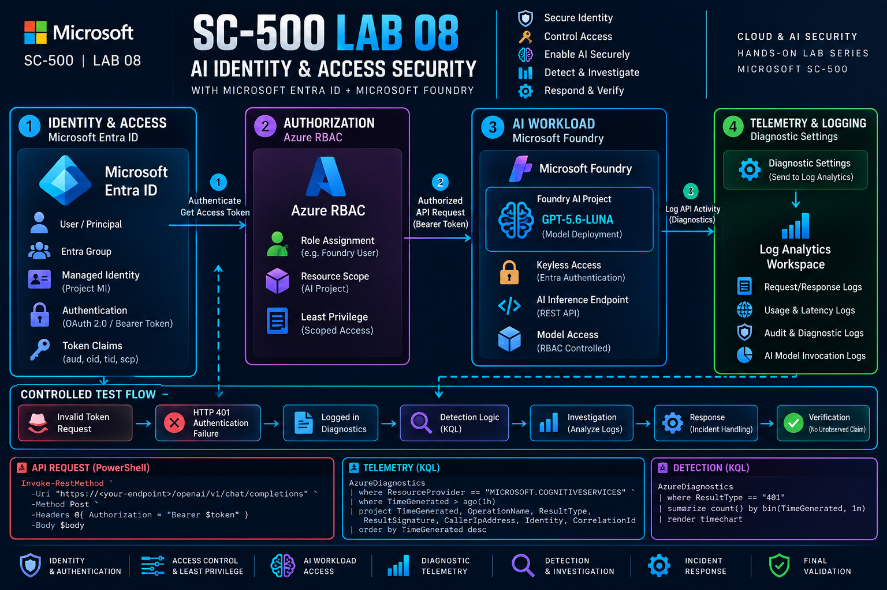

**Figure 02 — End-to-End AI Security Architecture**  
*The request path from the authenticated client through Entra ID, RBAC, Microsoft Foundry, keyless inference, telemetry, Log Analytics/KQL, detection, investigation, response, and verification.*

### Architecture Flow

```text
┌──────────────────────┐
│ Client / Engineer    │
│ PowerShell / REST    │
└──────────┬───────────┘
           │
           │ Entra Bearer Token
           ▼
┌──────────────────────┐
│ Microsoft Entra ID   │
│ Authentication       │
└──────────┬───────────┘
           │
           │ Identity Validated
           ▼
┌──────────────────────┐
│ Azure RBAC           │
│ Foundry User         │
│ Least Privilege      │
└──────────┬───────────┘
           │
           │ Authorized Request
           ▼
┌──────────────────────┐
│ Microsoft Foundry    │
│ AI Project           │
└──────────┬───────────┘
           │
           │ Keyless AI Inference
           ▼
┌──────────────────────┐
│ gpt-5.6-luna         │
│ Model Deployment     │
└──────────┬───────────┘
           │
           │ Diagnostic Activity
           ▼
┌──────────────────────┐
│ Azure Diagnostics    │
│ RequestResponse      │
│ Audit / Trace        │
│ AI Usage             │
└──────────┬───────────┘
           │
           ▼
┌──────────────────────┐
│ Log Analytics + KQL  │
└──────────┬───────────┘
           │
           ▼
┌──────────────────────┐
│ Detection             │
│ Investigation         │
│ Response              │
└──────────┬───────────┘
           │
           ▼
┌──────────────────────┐
│ Final Verification   │
└──────────────────────┘
```

---

# ☁️ Lab Environment

| Component | Value |
|---|---|
| Resource Group | `rg-sc500-ai-identity-lab` |
| Foundry Resource | `foundry-sc500-ai-identity` |
| Foundry Project | `proj-ai-identity` |
| Model | `gpt-5.6-luna` |
| Model Version | `2026-07-09` |
| RBAC Role | `Foundry User` |
| Identity | Microsoft Entra ID + Managed Identity |
| Telemetry | RequestResponse / Audit / Trace / AzureOpenAIRequestUsage |
| Investigation | Log Analytics + KQL |

---

# 🔐 Security Control Matrix

| Security Layer | Control | Validation |
|---|---|---|
| Identity | Microsoft Entra ID | Token / caller / tenant validation |
| Authentication | OAuth 2.0 / Bearer Token | Token audience validation |
| Authorization | Azure RBAC | Foundry User + resource scope |
| Workload Identity | Managed Identity | Project MI validation |
| Least Privilege | Scoped RBAC | Role + scope validation |
| Keyless Security | Local/key authentication disabled | API-key rejection |
| AI Workload | Foundry project + deployment | Authenticated inference |
| Telemetry | Diagnostic settings | RequestResponse / Audit / Trace / Usage |
| Detection | HTTP/KQL baselines | Status-code analysis |
| Investigation | Evidence-driven workflow | Token → Identity → RBAC → Telemetry |
| Response | Decision logic | 401 / 403 / 429 / 500+ |
| Verification | Final inference | Successful secure operation |

---

# 🪪 1. Identity & Authentication

The first security principle was:

> **Know who is calling the AI workload before evaluating what they can do.**

Validated:

- Entra token acquisition
- Token audience
- Caller object ID
- Tenant ID
- Project Managed Identity
- Separation between interactive identity and workload identity

Example:

```powershell
$modelTokenPlain = (Get-AzAccessToken `
    -ResourceUrl "https://cognitiveservices.azure.com").Token |
    ConvertFrom-SecureString -AsPlainText
```

Important token claims:

```text
aud
oid
tid
scp
```

### 📸 Evidence Screenshot

> **📌 Entra Token Audience:**  

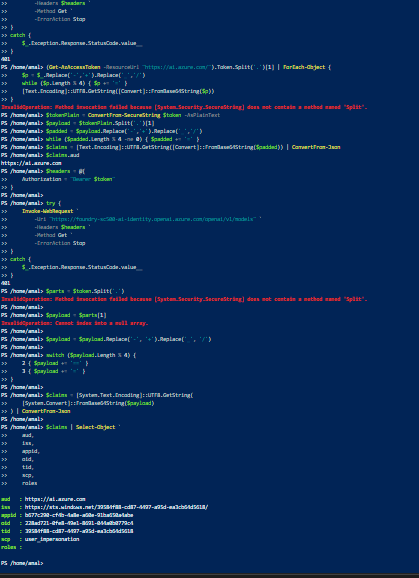

> **📌 Token Caller Identity:**  

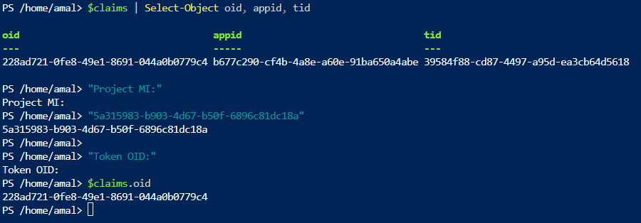

---

# 🔑 2. Authorization & Azure RBAC

The Project Managed Identity was correlated with its Azure RBAC assignment:

```powershell
Get-AzRoleAssignment `
    -ObjectId "<PROJECT-MANAGED-IDENTITY>"
```

Validated role:

```text
Foundry User
```

Security principle:

```text
AUTHENTICATION
      ≠
AUTHORIZATION
```

A valid token does not automatically mean the caller should have access.

### 📸 Evidence Screenshots

> **📌 Project Managed Identity** 

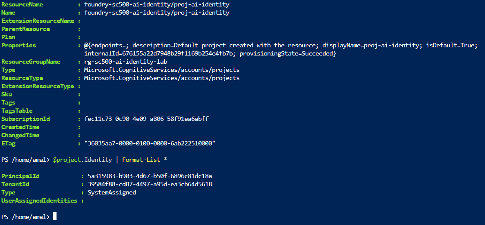
 
> **📌 Project MI RBAC:**  

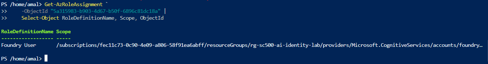

> **📌 RBAC Scope:** 

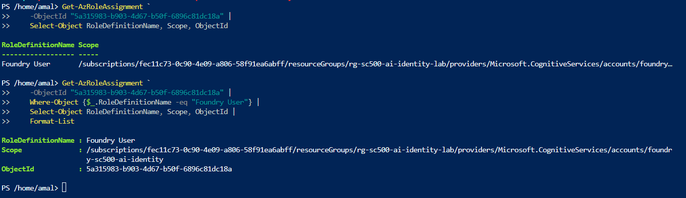

---

# 🪪 3. Managed Identity

The Foundry Project used a **System Assigned Managed Identity**.

The identity and principal ID were validated and correlated with RBAC:

```text
Foundry Project
      ↓
Managed Identity
      ↓
RBAC Assignment
      ↓
Foundry User
```

This demonstrates workload identity without embedding credentials in the application flow.

---

# 🔐 4. Keyless Authentication

Local/key-based authentication was disabled.

The intended security model was:

```text
API Key
   ✕
   ↓
Entra Bearer Token
   ✓
```

The successful request used:

```text
Authorization: Bearer <token>
```

and did not use:

```text
api-key
Ocp-Apim-Subscription-Key
```

### 📸 Evidence Screenshots

> **📌 Key Authentication Rejected:** 

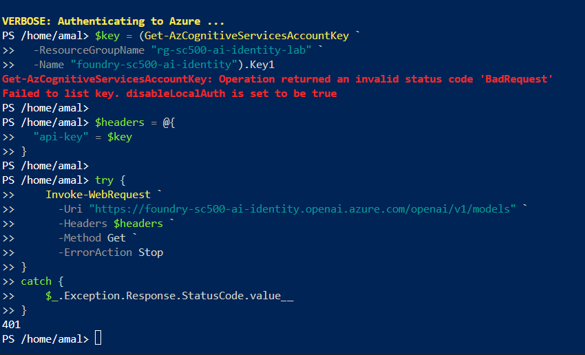

> **📌 Keyless Header Validation:** 

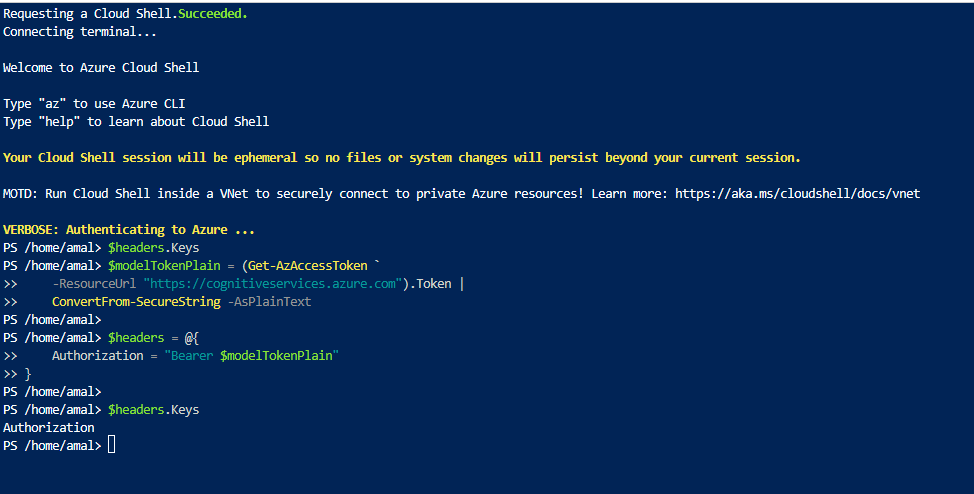

---

# 🤖 5. AI Workload Validation

The Foundry project endpoint and deployment were validated before inference.

```text
Model:
gpt-5.6-luna

Version:
2026-07-09
```

Successful inference was performed through the Foundry OpenAI v1 endpoint.

Final verification returned:

```text
FINAL_AI_VERIFICATION_OK
```

### 📸 Evidence Screenshots

> **📌 AI Project Endpoint:**   

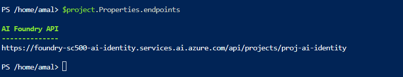

> **📌 Model Deployment:**  

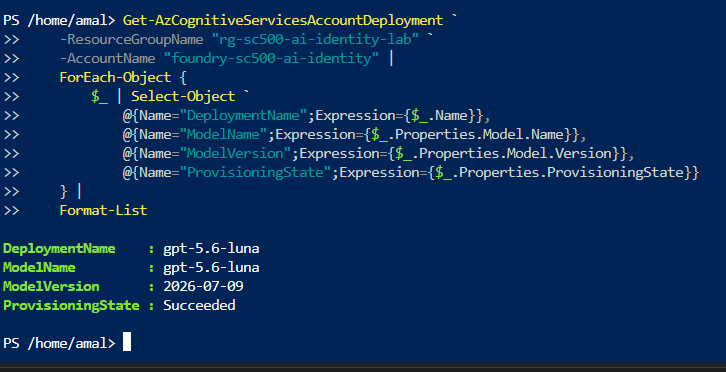

> **📌Authenticated AI Inference:** 

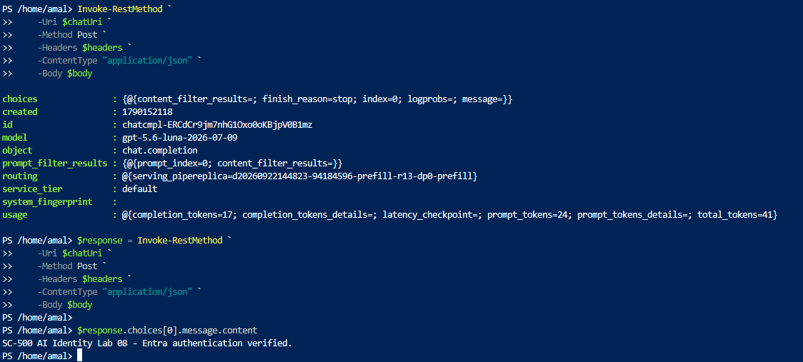
  
> **📌 Final AI Verification:** 

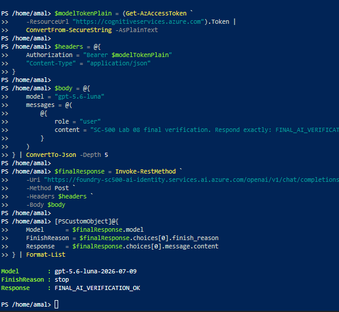

---

# 📊 6. Telemetry & Logging

> **📌 Telemetry & Security Workflow:** 

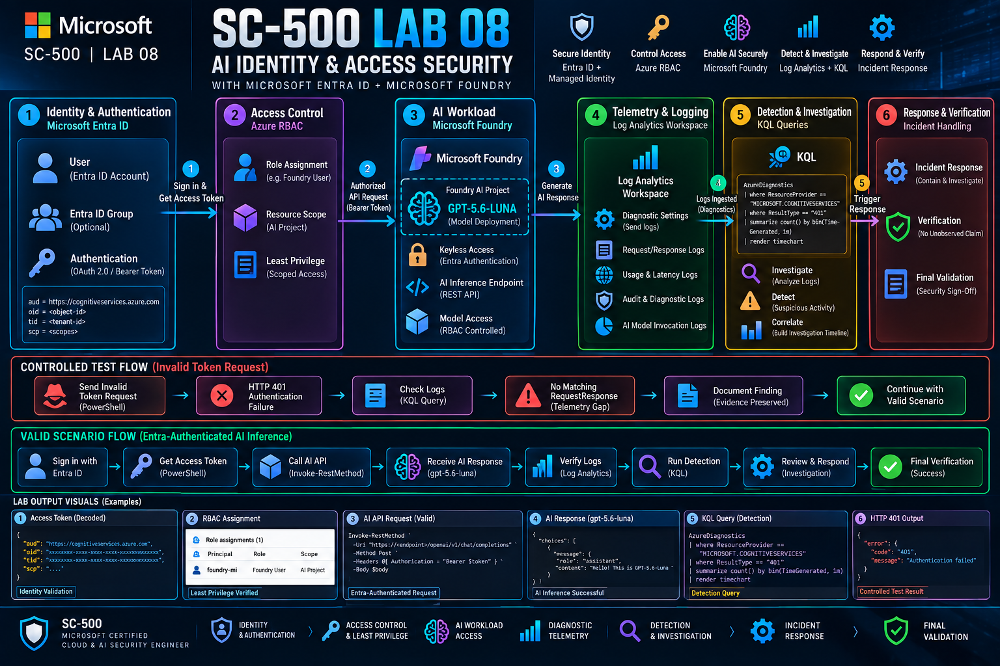

Validated diagnostic categories:

```text
RequestResponse
Audit
Trace
AzureOpenAIRequestUsage
```

Example KQL:

```kusto
AzureDiagnostics
| where ResourceProvider == "MICROSOFT.COGNITIVESERVICES"
| where ResourceId has "/providers/Microsoft.CognitiveServices/accounts/foundry-sc500-ai-identity"
| order by TimeGenerated desc
```

### 📸 Evidence Screenshots

> **📌 Diagnostic Settings:**

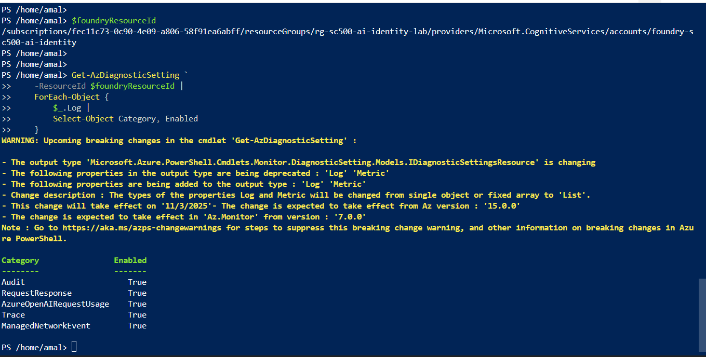
 
> **📌 Trace TelemetryPut:**   

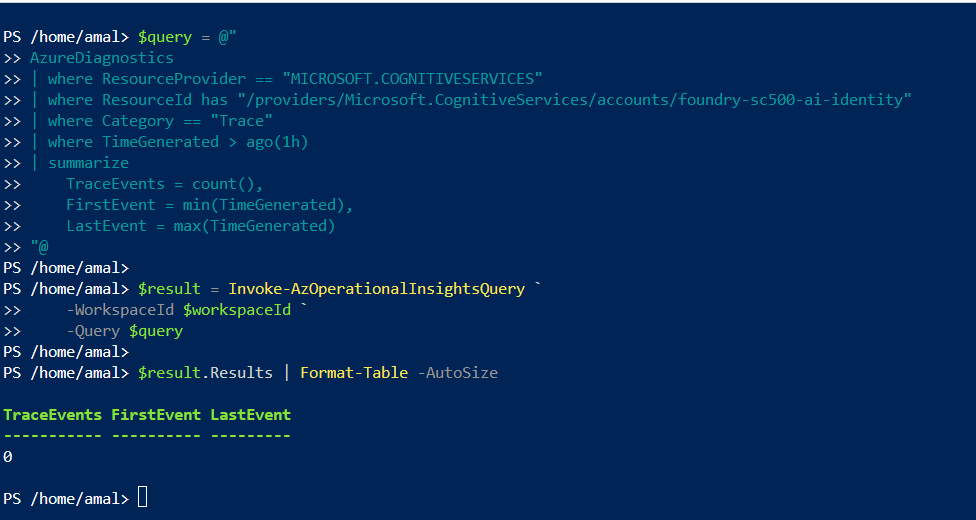

> **📌 AI Usage Event Validation:** 

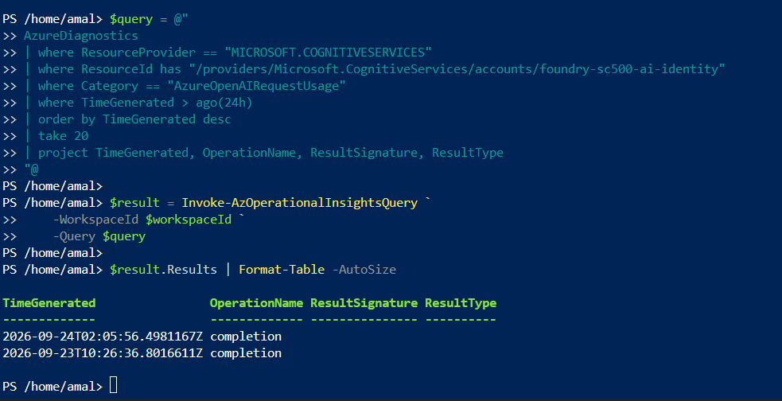
 
> **📌 AI Usage Event Detail:** 

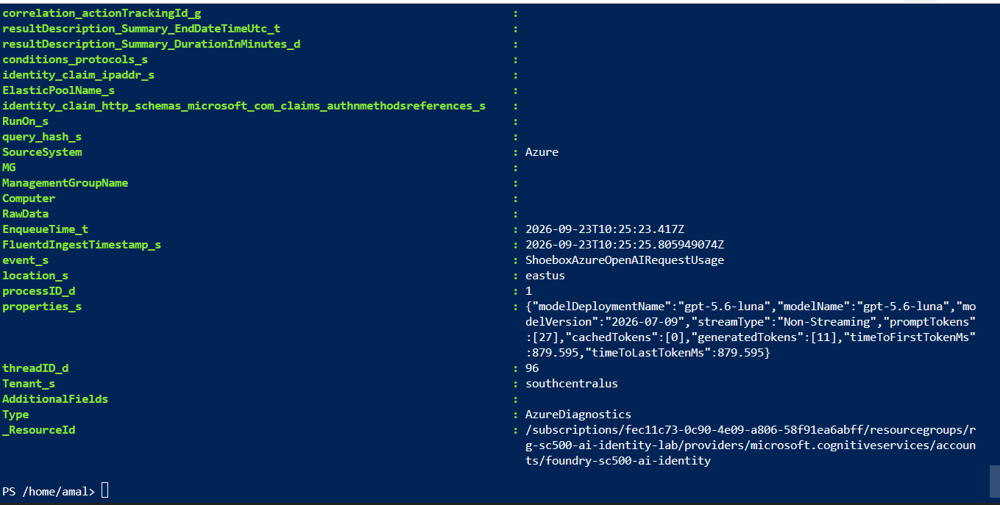
 
> **📌 AI Token & Latency Telemetry:** 

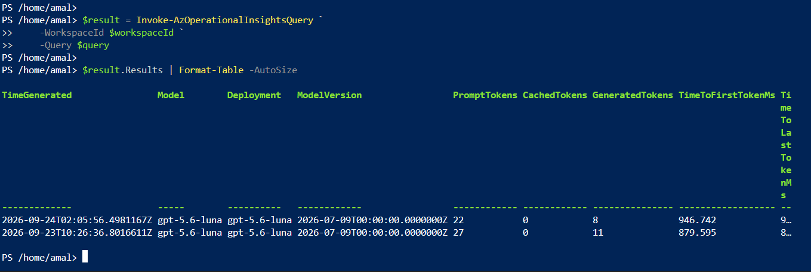


---

# 📈 7. AI Usage & Performance Telemetry

The lab parsed AI usage telemetry from `properties_s`.

Relevant fields included:

```text
modelName
modelDeploymentName
modelVersion
promptTokens
cachedTokens
generatedTokens
timeToFirstTokenMs
timeToLastTokenMs
streamType
```

This enabled workload-level investigation beyond simple HTTP status codes.

---

# 🚨 8. Controlled Security Test — HTTP 401

A controlled invalid-token request was deliberately generated against the AI API.

```text
Invalid Token
      ↓
HTTP 401
      ↓
Authentication Failure
      ↓
Investigation
```

Observed:

```text
HTTP 401
```

Classification:

```text
Authentication Failure
```

### 📸 Evidence Screenshot

> **📌 Controlled HTTP 401:** 


---

# 🕵️ 9. Investigation Logic

```text
HTTP 401
   ↓
Validate Token
   ↓
Validate Token Audience
   ↓
Validate Caller Identity
   ↓
Validate RBAC
   ↓
Validate Authentication Method
   ↓
Review RequestResponse Telemetry
```

Other response classifications:

```text
401 → Authentication Failure
403 → Authorization Failure
429 → Rate / Capacity Event
500+ → Service / Deployment Failure
```

### 📸 Response Logic

> **📌 Response Decision Logic:** 


---

# ⚠️ 10. Key Engineering Finding — Telemetry Correlation Gap

The controlled API-layer HTTP 401 was successfully reproduced.

However:

```text
API-layer HTTP 401
        = OBSERVED
```

while:

```text
Matching RequestResponse telemetry
        = NOT OBSERVED
```

within the queried correlation window.

Therefore, the lab did **not** claim that the 401 existed as a matching Log Analytics RequestResponse event.

It was documented as:

> **Telemetry Correlation Gap**

### Engineering Response

```text
Observed API evidence
        ↓
Preserve evidence
        ↓
Investigate diagnostic routing
        ↓
Check ingestion delay
        ↓
Check category behavior
        ↓
Check correlation timing
        ↓
Do not invent telemetry
```

### 📸 Evidence Screenshot

> **📌 Telemetry Correlation Gap:** 


---

# 🛡️ 11. Evidence Discipline

Central rule:

```text
NO EVIDENCE = NO CLAIM
```

Preserved:

- Timestamp
- HTTP status
- Identity
- Token audience
- RBAC role
- Resource scope
- Telemetry result
- Remediation result

This principle supports:

```text
SOC Investigation
Incident Response
Cloud Security Engineering
Detection Engineering
Security Auditing
```

---

# 🔄 12. Incident Response

For an authentication failure:

```text
IDENTIFY
   ↓
TRIAGE
   ↓
INVESTIGATE
   ↓
CONTAIN
   ↓
RECOVER
   ↓
VERIFY
   ↓
DOCUMENT
```

Investigation priorities:

```text
Token validity
      ↓
Token audience
      ↓
Caller identity
      ↓
RBAC
      ↓
Authentication method
      ↓
Telemetry
```

### 📸 Evidence Screenshot

> **📌 Incident Response Workflow:** 

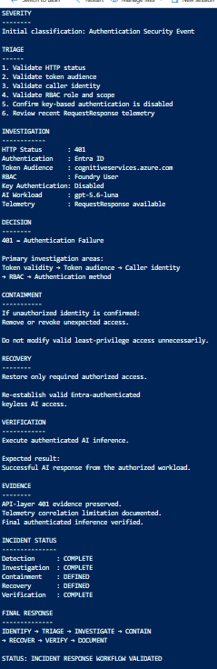

---

# 💻 13. Why PowerShell + REST API + KQL?

The lab intentionally used PowerShell and API-driven validation instead of making the Azure Portal the only validation mechanism.

### Azure Portal

```text
Configuration
Visualization
Resource management
```

### PowerShell

```text
Automation
Repeatability
RBAC inspection
Token acquisition
Configuration validation
Security testing
```

### REST API

```text
Real authentication behavior
HTTP status validation
Bearer-token testing
AI inference validation
```

### KQL

```text
Telemetry investigation
Detection engineering
Correlation
Baselining
Threat hunting
```

Together:

```text
Portal
 +
PowerShell
 +
REST API
 +
KQL
 =
Cloud Security Engineering
```

---

# 📋 14. Evidence Traceability

| Evidence | Security Area | Validation |
|---|---|---|
| E19 | Keyless Security | API-key authentication failure |
| E20 | Identity | Entra token audience |
| E21 | Identity | Token caller identity |
| E22 | Managed Identity | Project MI |
| E23 | RBAC | Project MI role |
| E24 | RBAC | RBAC scope |
| E25 | AI Workload | Project endpoint |
| E26 | AI Workload | Model deployment |
| E27 | Authentication | Cognitive Services token |
| E28 | AI Access | Authenticated AI inference |
| E29 | Keyless Security | Authentication header validation |
| E59–E60 | Telemetry | RequestResponse / success baseline |
| E62 | Telemetry | Diagnostic settings |
| E63 | Telemetry | Trace |
| E64–E66 | AI Usage | Usage / tokens / latency |
| E67–E68 | Detection | Security / HTTP baseline |
| E69 | Detection | Controlled HTTP 401 |
| E70 | Investigation | Telemetry correlation gap |
| E71 | Response | Security response logic |
| E72 | Verification | Final AI response |
| E73 | Assessment | Security assessment |
| E74 | Reporting | Executive summary |
| E75 | Architecture | Attack / defense architecture |
| E76 | Governance | Security control matrix |
| E77 | Audit | Audit handoff |
| E78 | Response | Incident response workflow |
| E79 | Hardening | Final hardening assessment |
| E80 | Interview | Engineer viva summary |
| E81 | Validation | Final security validation |
| E82 | Audit | Final evidence index |
| E83 | Sign-off | Final security sign-off |

---

# 🧪 15. Attack / Defense Model

## Attack Path

```text
Invalid Token / Key Attempt
          ↓
       HTTP 401
          ↓
Authentication Investigation
          ↓
Evidence Preservation
```

## Defense Path

```text
Entra Authentication
          ↓
Azure RBAC
          ↓
Least Privilege
          ↓
Keyless Access
          ↓
Telemetry
          ↓
Detection
          ↓
Investigation
          ↓
Response
          ↓
Verification
```

---

# 🧱 16. Security Hardening Lessons

### Identity Hardening

Use Entra ID as the primary authentication mechanism.

Validate:

- Caller identity
- Token audience
- Token validity
- Tenant identity

### Authorization Hardening

```text
Required Permission
        ↓
Minimum Role
        ↓
Minimum Scope
```

### Keyless Security

Where Entra authentication is supported:

```text
Disable unnecessary local/key authentication
```

Avoid embedding:

- API keys
- Secrets
- Credentials

inside applications or automation.

### Managed Identity

Use Managed Identity for Azure workload-to-Azure authentication where supported.

### Telemetry

Continuously review relevant diagnostic categories.

### Detection

```text
401 → Authentication
403 → Authorization
429 → Rate / Capacity
500+ → Service / Deployment
```

---

# 🧠 17. Engineer-Level Takeaway

The core question of the lab was:

> **Can I prove not only that the AI workload works, but also who accessed it, how they authenticated, what they were authorized to do, what happened, whether it was observable, how failures would be detected, and how secure operation would be verified afterwards?**

The answer was validated through the evidence chain.

---

# 🏁 18. Final Security Conclusion

The lab validated an:

> **Entra-authenticated, RBAC-controlled, least-privilege, keyless AI workload with diagnostic telemetry, detection logic, controlled security testing, incident-response procedures, and final verification.**

The primary identified limitation was the absence of a matching RequestResponse telemetry record for the controlled API-layer HTTP 401 within the queried correlation window.

That limitation was documented as an engineering finding rather than incorrectly represented as observed telemetry.

---

# 🔒 19. Final Security Principle

```text
IDENTITY
   ↓
LEAST PRIVILEGE
   ↓
KEYLESS AUTHENTICATION
   ↓
AI WORKLOAD PROTECTION
   ↓
TELEMETRY
   ↓
DETECTION
   ↓
INCIDENT RESPONSE
   ↓
VERIFICATION
```

---

# 🏆 Final Status

<div align="center">

### 🔒 SC-500 LAB 08 — AI IDENTITY & ACCESS SECURITY

**SECURITY VALIDATION: COMPLETE**

**SECURITY SIGN-OFF: COMPLETE**

**EVIDENCE CHAIN: E19 → E83**

</div>

---

# 📸 Evidence Screenshot Placement Guide

The README intentionally identifies **where each saved screenshot belongs**. Store screenshots under `docs/evidence/` and use the exact filenames shown below so GitHub renders them automatically.

### Naming pattern

```text
docs/evidence/E##-descriptive-name.png
```

### Visual evidence used directly in the README

| Evidence | Where it appears | Purpose |
|---|---|---|
| E19 | Keyless Authentication | Proves API-key authentication rejection |
| E20–E21 | Identity & Authentication | Proves token audience and caller identity |
| E22–E24 | RBAC / Managed Identity | Proves workload identity, role, and scope |
| E25–E26 | AI Workload | Proves project endpoint and deployment |
| E28–E29 | Keyless AI Access | Proves authenticated inference and keyless headers |
| E62–E63 | Telemetry | Proves diagnostics and trace visibility |
| E69–E71 | Detection / Investigation | Proves controlled 401, telemetry correlation, and response logic |
| E72 | Verification | Proves final successful AI response |
| E78 | Response | Proves incident-response workflow |

> **📌 Evidence caption rule:** Every embedded screenshot has a short engineering caption explaining **what the screenshot proves and why it matters**.

---

# 📸 Complete Evidence Gallery — Captioned Screenshots

> **Evidence documentation standard:** Every screenshot below has an explicit engineering caption describing **what the evidence shows, what control it validates, and why it matters**.

> **Repository path:** `docs/evidence/`

## Evidence 19 — Keyless Security


**Figure E19 — Controlled validation showing that local/key-based authentication was rejected after key authentication was disabled.**

## Evidence 20 — Identity & Authentication


**Figure E20 — Microsoft Entra bearer-token audience validation confirming the token was issued for the Cognitive Services resource.**

## Evidence 21 — Identity & Authentication


**Figure E21 — Token caller identity validation correlating the token OID with the authenticated caller and distinguishing it from the Foundry Project Managed Identity.**

## Evidence 22 — Managed Identity


**Figure E22 — Microsoft Foundry Project Managed Identity validation showing the system-assigned workload identity and principal identity.**

## Evidence 23 — Authorization / RBAC


**Figure E23 — Azure RBAC validation confirming the Foundry User role assigned to the Project Managed Identity.**

## Evidence 24 — Authorization / RBAC


**Figure E24 — RBAC scope validation confirming authorization is applied at the intended Foundry resource scope.**

## Evidence 25 — AI Workload


**Figure E25 — Microsoft Foundry AI Project endpoint validation confirming the target project API endpoint.**

## Evidence 26 — AI Workload


**Figure E26 — Model deployment validation confirming the gpt-5.6-luna deployment and successful provisioning state.**

## Evidence 27 — Authentication

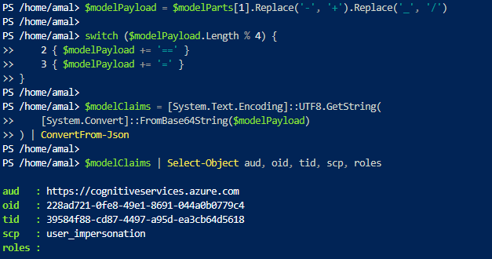

**Figure E27 — Cognitive Services Entra token validation confirming the token audience and authenticated security context used for AI access.**

## Evidence 28 — AI Workload Access


**Figure E28 — Successful AI inference using an Entra bearer token against the deployed Foundry model, proving authenticated workload access.**

## Evidence 29 — Keyless Security


**Figure E29 — Authentication-header validation showing bearer-token authorization without an API-key or subscription-key header.**

## Evidence 59 — Telemetry


**Figure E59 — RequestResponse telemetry validation establishing observable AI request activity in the monitoring workflow.**

## Evidence 60 — Telemetry / Baseline


**Figure E60 — Successful-request baseline establishing the expected HTTP status and request behavior before controlled security testing.**

## Evidence 62 — Telemetry


**Figure E62 — Diagnostic settings validation confirming the configured telemetry routing for the Foundry security monitoring workflow.**

## Evidence 63 — Telemetry


**Figure E63 — Trace telemetry validation confirming the availability of detailed diagnostic trace data.**

## Evidence 64 — AI Usage Telemetry


**Figure E64 — AI usage telemetry event showing model and deployment activity generated by the workload.**

## Evidence 65 — AI Usage Telemetry


**Figure E65 — Detailed AI usage telemetry showing parsed workload metadata and model execution information.**

## Evidence 66 — AI Performance Telemetry


**Figure E66 — AI token and latency telemetry providing performance-level visibility into the model inference workflow.**

## Evidence 67 — Detection

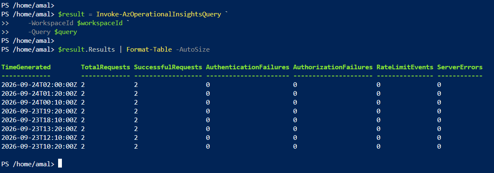

**Figure E67 — AI security detection baseline establishing observable conditions used to support subsequent security investigation.**

## Evidence 68 — Detection / Telemetry


**Figure E68 — RequestResponse HTTP baseline establishing normal status-code behavior for comparison with controlled failures.**

## Evidence 69 — Controlled Detection


**Figure E69 — Controlled API-layer HTTP 401 reproduced intentionally to validate authentication-failure detection and investigation logic.**

## Evidence 70 — Investigation


**Figure E70 — Correlation query showing that the controlled API-layer event was not matched by a RequestResponse telemetry record within the queried time window.**

## Evidence 71 — Response


**Figure E71 — Security response decision logic mapping HTTP conditions to authentication, authorization, capacity, and service investigation paths.**

## Evidence 72 — Final Verification


**Figure E72 — Final Entra-authenticated AI response confirming that the secured workload remained operational after security validation.**

## Evidence 73 — Security Assessment


**Figure E73 — Final security assessment consolidating the validated identity, access, telemetry, detection, response, and verification controls.**

## Evidence 74 — Executive Reporting


**Figure E74 — Executive security summary presenting the lab objective, attack path, prevention controls, detection, investigation, response, telemetry limitation, and final verification.**

## Evidence 75 — Architecture


**Figure E75 — Attack/defense architecture showing how an invalid authentication attempt is investigated and how the protected AI workload is secured end-to-end.**

## Evidence 76 — Governance / Control Validation

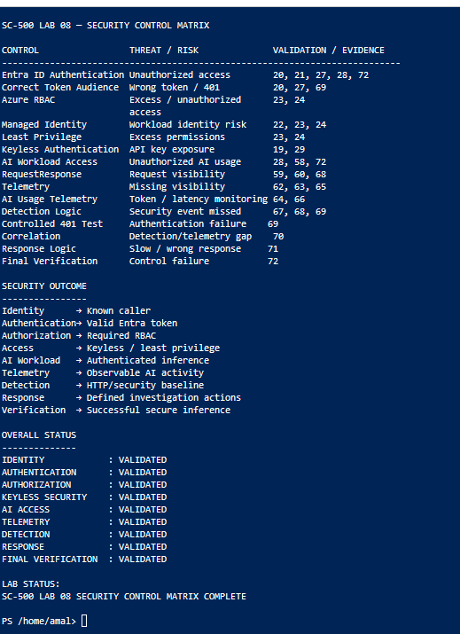

**Figure E76 — Security control matrix mapping threats and risks to the corresponding technical validation and evidence.**

## Evidence 77 — Audit / Evidence Traceability


**Figure E77 — Audit handoff connecting identity, access, AI workload, telemetry, detection, response, and final validation evidence.**

## Evidence 78 — Incident Response


**Figure E78 — Incident response workflow covering identification, triage, investigation, containment, recovery, verification, and documentation.**

## Evidence 79 — Security Hardening

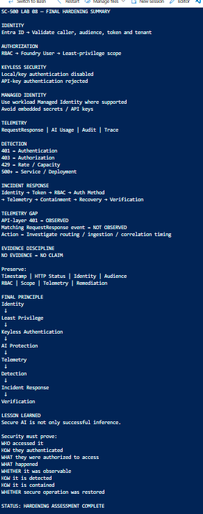

**Figure E79 — Final hardening assessment documenting identity, authorization, keyless security, managed identity, telemetry, detection, response, and evidence-discipline lessons.**

## Evidence 80 — Engineer Walkthrough

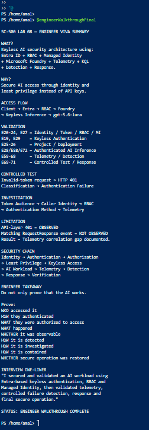

**Figure E80 — Engineer-level walkthrough summarizing what was built, why it was built, how access works, what was validated, and how the security event was investigated.**

## Evidence 81 — Final Validation

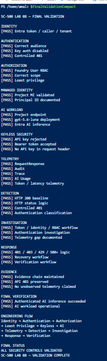

**Figure E81 — Final security validation checklist confirming the required identity, authentication, authorization, telemetry, detection, investigation, response, evidence, and verification controls.**

## Evidence 82 — Evidence Index

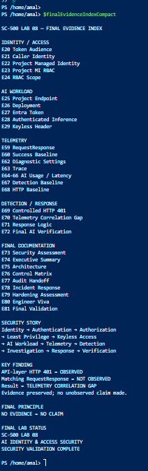

**Figure E82 — Final evidence index providing the traceable mapping from security controls and findings to the supporting evidence chain.**

## Evidence 83 — Security Sign-Off

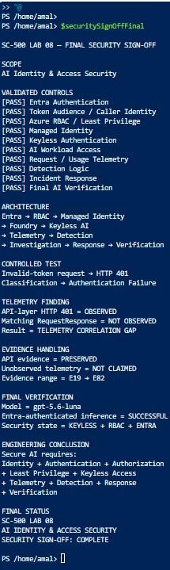

**Figure E83 — Final security sign-off confirming the validated AI identity and access security architecture, controlled test result, telemetry limitation, and successful final inference.**

## 📁 Evidence File Naming Standard

Use the exact filenames below so GitHub renders the evidence automatically:

```text
19-key-based-authentication-failure.png
20-entra-token-audience-validation.png
21-token-caller-identity-validation.png
22-project-managed-identity-validation.png
23-project-mi-rbac-validation.png
24-project-mi-rbac-scope-validation.png
25-ai-project-endpoint-validation.png
26-deployment-validation.png
27-cognitive-services-entra-token-validation.png
28-entra-authenticated-ai-inference.png
29-keyless-authentication-header-validation.png
59-requestresponse-telemetry.png
60-request-success-baseline.png
62-diagnostic-settings-validation.png
63-trace-telemetry-validation.png
64-ai-usage-event-validation.png
65-ai-usage-event-detail.png
66-ai-token-latency-telemetry.png
67-ai-security-detection-baseline.png
68-requestresponse-http-baseline.png
69-controlled-http-401.png
70-telemetry-correlation-gap.png
71-security-response-decision-logic.png
72-final-ai-response-verification.png
73-final-security-assessment.png
74-executive-summary.png
75-attack-defense-architecture.png
76-security-control-matrix.png
77-audit-handoff.png
78-incident-response-workflow.png
79-final-hardening-assessment.png
80-engineer-viva-summary.png
81-final-security-validation.png
82-final-evidence-index.png
83-final-security-sign-off.png
```

> **Important:** The README provides the documentation locations and captions. Copy/rename each saved screenshot into `docs/evidence/` using the exact filename shown above before pushing the repository.

# 📁 Recommended Repository Structure

```text
SC-500-Lab-08-AI-Identity-Access-Security/
│
├── README.md
│
├── docs/
│   ├── images/
│   │   ├── sc-500-lab-08-banner.png
│   │   ├── sc-500-lab-08-architecture.png
│   │   └── sc-500-lab-08-visual.png
│   │
│   └── evidence/
│       ├── 19-key-based-authentication-failure.png
│       ├── 20-entra-token-audience-validation.png
│       ├── ...
│       └── 83-final-security-sign-off.png
│
├── scripts/
│   ├── 01-identity-validation.ps1
│   ├── 02-rbac-validation.ps1
│   ├── 03-keyless-authentication.ps1
│   ├── 04-ai-inference.ps1
│   ├── 05-telemetry-investigation.ps1
│   ├── 06-detection.ps1
│   └── 07-response-validation.ps1
│
├── kql/
│   ├── request-response.kql
│   ├── ai-usage.kql
│   ├── authentication-detection.kql
│   └── telemetry-correlation.kql
│
└── evidence-index/
    └── evidence-traceability.md
```

---

## 👨‍💻 Author

**Amal Udayanga Basnayake**

`Cybersecurity | Azure Security | Microsoft Security | SIEM | Threat Detection | AI Security`

---

> ### 🧠 Engineering Mindset
>
> **Don't just make the workload work.**
>
> Prove **why** it works, **who** can access it, **how** they authenticate, **what** they are authorized to access, **what** happens when security controls are challenged, **what telemetry exists**, **what telemetry is missing**, and **how secure operation is verified afterwards**.
